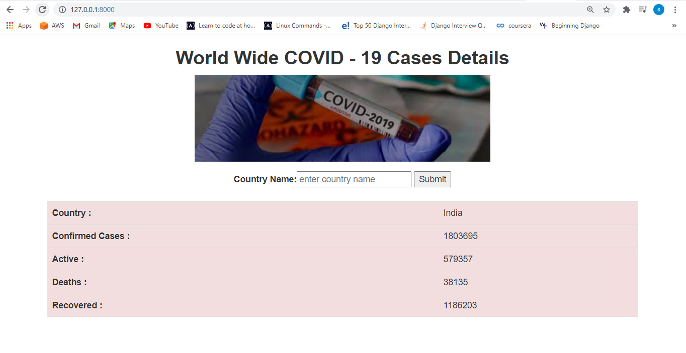

# COVID - 19 Prediction Based On Country Wise

## This is built using the django Web Framework and Covid Package

### To setup this webpage.
### run the requirements.txt file by using the below command.

`pip install -r requirements.txt`

#### When the user enters the country name in search field and clicks on the submit button.

#### As per above image the result is displayed in the webpage.

#### Incase if the user enters the wrong country name in the search field and clicks on the submit button.

#### As per above image the result is displayed in the webpage.

